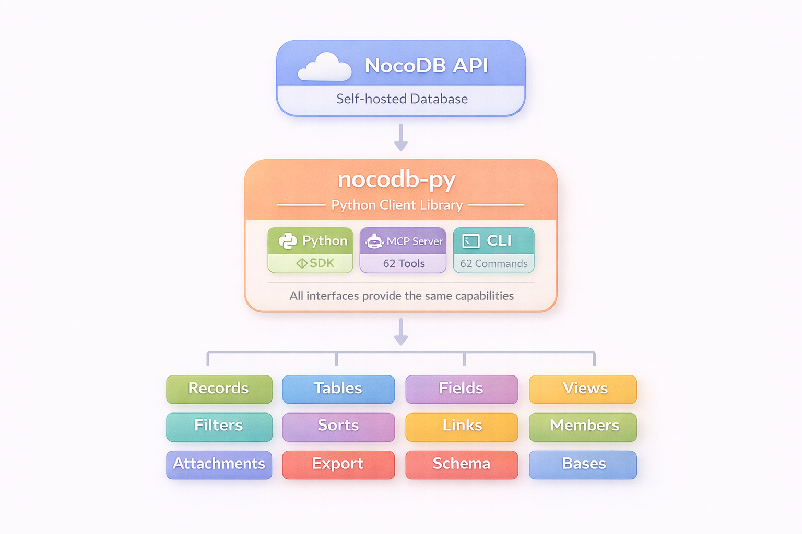

<h1 align="center">NocoBot</h1>

<h2 align="center"><strong>Telegram Bot + Python SDK for Self-Hosted NocoDB</strong></h2>

<p align="center">
  <a href="https://www.gnu.org/licenses/agpl-3.0"></a>
  <a href="https://www.python.org/downloads/"></a>
</p>

<p align="center">Chat with your NocoDB databases through Telegram. Powered by an LLM agent with 62 MCP tools.</p>

---

## What is NocoBot?

NocoBot is a Telegram bot that lets you query and manage your self-hosted NocoDB databases using natural language. Ask it to list tables, create records, update fields, or export data — it figures out the right API calls and does it for you.

Under the hood, NocoBot connects an LLM (Claude, GPT, or any OpenRouter model) to NocoDB through the Model Context Protocol (MCP). The bundled Python SDK exposes 62 tools covering the full NocoDB API, which the bot's agent loop calls as needed to fulfill your requests.

---

## Key Features

### Telegram Bot
- **Natural language interface** — ask questions, get answers from your database
- **LLM-powered agent loop** — automatic tool selection and multi-step reasoning
- **Progressive text streaming** — responses appear incrementally, not all at once
- **Media support** — send photos, voice, audio, and documents
- **Per-user rate limiting** — configurable token bucket (10 msg/60s default)
- **Session management** — multi-turn conversations with automatic history trimming
- **Default-deny access control** — allowlist-based, secure by default
- **Commands** — `/new` (clear history), `/stop` (cancel processing), `/help`

### NocoDB SDK + MCP Server + CLI
- **Python SDK** — full v3 Data API + hybrid v2/v3 Meta API (123 tests)
- **MCP Server** — 62 tools for Claude Desktop and AI integrations (FastMCP 3.0)
- **CLI** — 62 commands auto-generated from MCP server
- **Self-hosted first** — built for community edition, not enterprise

---



---

## Quick Start

### NocoBot (Telegram)

```bash
# Install
pip install git+https://github.com/steve-goldberg/nocobot.git#subdirectory=nocobot

# Configure
export TELEGRAM_TOKEN="your-telegram-bot-token"
export OPENROUTER_API_KEY="your-openrouter-key"
export NOCODB_MCP_URL="http://your-mcp-server/mcp"
export TELEGRAM_ALLOW_FROM='["your_telegram_username"]'

# Run
python -m nocobot
```

### NocoDB MCP Server

```bash
# Install with MCP server
pip install "nocodb[cli,mcp] @ git+https://github.com/steve-goldberg/nocobot.git#subdirectory=nocodb"

# Configure
export NOCODB_URL="http://localhost:8080"
export NOCODB_TOKEN="your-api-token"

# Run MCP server (HTTP)
python -m nocodb.mcpserver --http --port 8000

# Or use the CLI directly
nocodb records list BASE_ID TABLE_ID
```

### Python SDK

```python
from nocodb import APIToken
from nocodb.infra.requests_client import NocoDBRequestsClient

client = NocoDBRequestsClient(APIToken("your-token"), "http://localhost:8080")
records = client.records_list_v3(base_id, table_id)
```

---

## Monorepo Structure

| Service | Path | Description | Dokploy Context |
|---------|------|-------------|-----------------|
| **nocobot** | `/nocobot/` | Telegram bot with MCP agent | `nocobot` |
| **nocodb** | `/nocodb/` | Python SDK + MCP Server + CLI | `nocodb` |

---

## Documentation

| Document | Description |
|----------|-------------|
| [Deploy Bot](nocobot/docs/DEPLOY_BOT.md) | Telegram bot Dokploy deployment |
| [Deploy MCP](nocodb/docs/DEPLOY_MCP.md) | MCP server Dokploy deployment |
| [SDK](nocodb/docs/SDK.md) | Python client API reference |
| [CLI](nocodb/docs/CLI.md) | Command-line interface usage |
| [MCP Server](nocodb/docs/MCP.md) | AI assistant integration |
| [Filters](nocodb/docs/FILTERS.md) | Query filter system |

---

## Recent Changes

- Persist tool calls and results to conversation history for better multi-turn conversations
- Media file size limit (20MB) and disk cap (500MB) for safe media handling
- Hardened error messages — no more leaking NocoDB internals to users
- Persistent MCP session with lazy reconnect (no more per-call TCP handshakes)
- TTL eviction for stale sessions and rate limiter buckets
- Progressive text streaming and markdown table rendering
- Default-deny access control and API key leak prevention

---

## Contributing

See [CONTRIBUTING.md](nocodb/docs/CONTRIBUTING.md) for guidelines.

---

## License

AGPL-3.0

SDK based on [nocodb-python-client](https://github.com/ElChicoDePython/python-nocodb) by Samuel Lopez Saura (MIT 2022).
